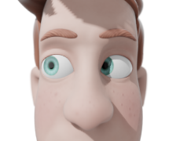
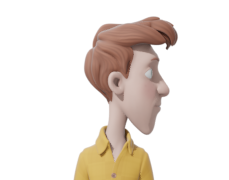
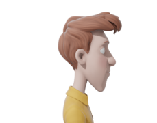
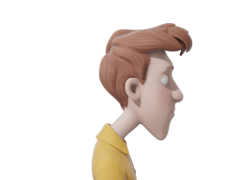
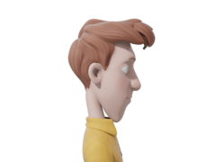

# EyeVincent v0.9

Опенсорсный клон программы EyeLeo, напоминающей делать перерывы при работе за компьютером.

## Лицензия
Весь исходный код выпущен под GNU GPL Version 2

## Описание
Напоминает и даже иногда принуждает делать перерывы при работе за компьютером.
- ***Короткий перерыв*** показывает на каждом экране маленькое окошечко с напоминанием сделать упражнения для глаз или для шеи. Ниже приведены все короткие перерывы:
	- глаза влево-вправо
	
		
		

	- глаза вверх-вниз

		
		

	- зажмурить глаза

		
		

	- легко и быстро поморгать

		
		

	- посмотреть в окно

		

	- закрыть глаза ладонями

		

	- повороты головы влево и вправо

		
		
		
		

	- наклоны головы вперёд и назад

		
		
		
		

	- наклоны шеи влево и вправо

		
		
		
		

	- вытягивание шеи вперёд и назад

		
		
		
		

	- наклонять голову вверх и вниз смотря на одну и ту же точку в пространстве (https://www.youtube.com/watch?v=WjfvF6I_NhY)

		
		
		
		

	- крутить головой влево и вправо смотря на одну и ту же точку в пространстве (https://www.youtube.com/watch?v=WjfvF6I_NhY)

		
		
		
		

- ***Большой перерыв*** полностью блокирует все экраны. Правда, при необходимости блокировку можно отменить не дожидаясь её конца через контекстное меню в верхней части любого блокирующего окна.
	- Если под Новый Год выставить `RUN_LED_GARLAND` в `True`, то во время большого блокирующего перерыва программа будет играть светодиодами на клавиатуре, что может вводить в изумление установленные на компьютере программы, если их работа как-то зависит от переключения состояний CAPS LOCK, NUM LOCK и SCROLL LOCK. Правда, в коде  выбран соотвествующий тайминг переключения светодиодов, чтобы этого изумления не происходило. Не знаю как будет обстоять дело на других компах, на моём всё окей в итоге. Один цикл работы такой гирлянды около 18 секунд. Если большой перерыв прервать заблаговременно, то придётся ждать окончания цикла вплоть до 18 секунд в зависимости от того как повезёт.
	- Во время большого перерыва в нижней части каждого блокирующего окна можно написать какую-то заметку. Заметка будет сохранена в файл рядом с файлом приложения, файл заметки будет назван исходя из текущей даты и времени на момент запуска блокирующего экрана.

## Зависимости
Зависимости прописаны в файле `install_dependencies.bat`.

## Запуск и нормальный режим работы 
Нужно 
1) установить Python.
Устанавливая Python нужно обязательно прожать галочку около пункта "Add Python X.XX to PATH", иначе проблемы с установкой зависимостей в следующем шаге придётся решать вручную 

2) установить все зависимости - запустить `install_dependencies.bat`
3) наконец запустить приложение, кликнув по файлу `eyeVincentLauncher.pyw`. В трее должна появиться иконка и приложение должно начать отсчитывать время до короткого и больших перерывов. Через клик по иконке в трее доступно информационное окно с командами

За 30 секунд до начала большого перерыва появится окно с уведомлением, которое будет видно в период этих 30 секунд. В окне уведомления можно отложить перерыв на 10 минут или пропустить его.

## Режим дебага
Режим дебага активируется через задание `Globals.DEBUG` в значение `True`. В режиме дебага также запускается `eyeVincent.pyw`.
Если `Globals.DEBUG_DURATION` выставлена меньше, чем `LONG_DURATION_TRESHOLD`, то при запуске будет продемонстрирован короткий перерыв, иначе - длинный. Длительность перерыва определяется значением `Globals.DEBUG_DURATION`.

## Настройки
Настройки не задаются в специальном окне или типа того, поэтому потребуется править исходный код на Python.
Временные промежутки и длительности для короткого и большого перерывов настраиваются в атрибутах класса `Globals`, конкретно нужно править переменные `LONG_BREAK_INTERVAL` и `SHORT_BREAK_INTERVAL`, `LONG_BREAK_DURATION` и `SHORT_BREAK_DURATION`. Все они задаются в секундах.

### Адаптация под маломощные машины
Уменьшать `Globals.SYMBOLS_COUNT`и увеличивать `Globals.WINDOWS_UPDATE_INTERVAL`. Последнее задаётся в миллисекундах.

## Анимация коротких перерывов
Для анимаций в программе использовались рендеры 3D-модели Vincent от Blender Animation Studio https://studio.blender.org/characters/5718a967c379cf04929a4247/v2/
Исходник с анимациями - файл `vincent_animations.blend`. Файл надо открывать в версии Blender 3.3.1 - с другими версями теоритически могут быть проблемы. Для переименовывания файлов после рендера есть скрипт `rename_files_after_render.py`, внутри скрипта прописана инструкция по его применению.

Изначально планировалось взять модельку жирного кролика из Big Buck Bunny, но она в итоге не подошла, потому что у кролика совсем нет шеи.

## Инфа о крашах
Если программа упадёт с ошибкой, инфа о причине (точнее питоновский трейсбэк) будет записана в `crush.log` в папке приложения.

## Механизм определения полноэкранного режима у работающих на компьютере приложений
Для каждого экрана отдельно вычисляется координата середины экрана. С помощью API Windows для каждой такой координаты выясняется дискриптор окна, область которого включает эту координату, и которое отображается поверх всех окон. По каждому дискриптору окна запрашиваются положение и размер области такого окна. Если положение и размер одно из окон совпадает с положением и размером экрана в общей координатной системе, то считается, что открыто полноэкранное приложение.
Дополнительно в этот механизм добавлены исключения:
1) Для компьютеров, имеющих лишь один подключённый монитор, сделано исключение для процесса explorer.exe, так как окно рабочего стола занимает всё пространство экрана. И если рабочий экран был бы открыт постоянно, то программа считала бы, что рабочий стол Windows это полноэкранное приложение, и программа никогда бы не показала уведомление в таком случае. На компьютерах с более чем одним монитором этой проблемы нет, потому что в таком случае окно рабочего стола Windows растянуто на все мониторы, и размер и положение такой области точно не может совпасть с положением и размером одного из экранов в общей координатной системе.
2) Для проигрывателя VLC сделано особенное исключение: если под центральную координату экрана попало окно процесса vlc.exe, то программа считает, что открыто полноэкранное приложение. Это сделано из-за того, что в своём полноэкранном режиме VLC не создаёт полноценного полноэкранного окна, при этом область окна будет зависеть от размеров самого видео.
3) Координата середины экрана может быть опционально сдвинута в любую сторону в случае, если во время короткого перерыва (когда по центру каждого экрана показывается окно уведомления) одно из приложений стало полноэкранным и нужно это отследить, чтобы быстро убрать окна с уведомлениями. Подробности смотреть в коде функции `auto_close_on_fullscreen_window`.

## Проблема с утечкой памяти и её решение
У аппликухи большие проблемы с утечкой памяти. Решить их так и не удалось, хотя я освобождал все ресурсы, которые брал. К тому же сами большие и короткие перерывы запускаются в новых процессах из этого же файла. А сама проблема с памятью вот в чём: через два дня после запуска прога начинает занимать полгига в оперативке и размер постоянно растёт. В итоге решил пока поступить так: программа сама себя перезапускает сразу после окончания большого перерыва при условии, что с момента запуска прошло больше трёх часов.

28.06.2023
	- отключено меню у невидимого текстового поля
	- теперь можно видеть часы во время большого перерыва
	- окно-уведомление теперь не показывается до тех пор, пока не будет замечена активность пользователя (через мышку или клавиатуру)
